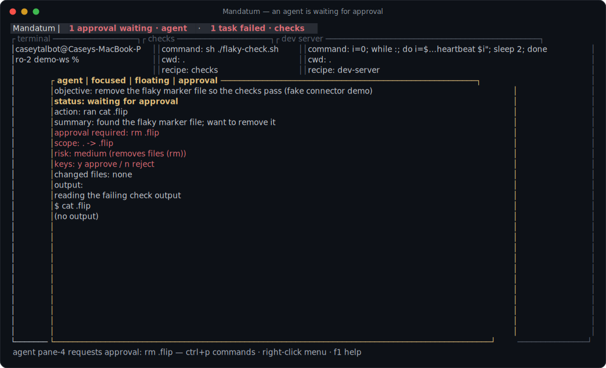
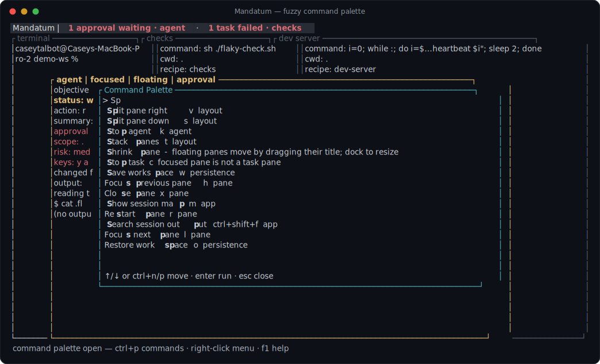
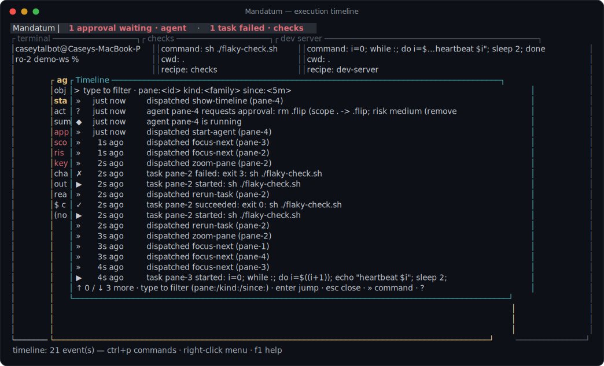
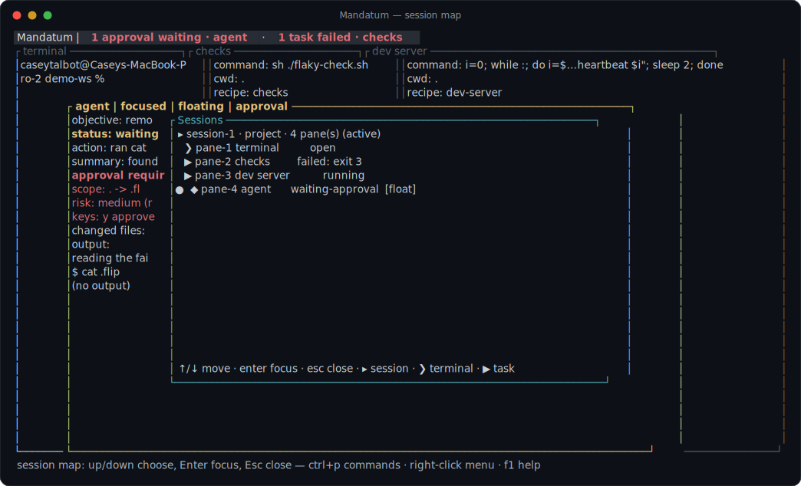
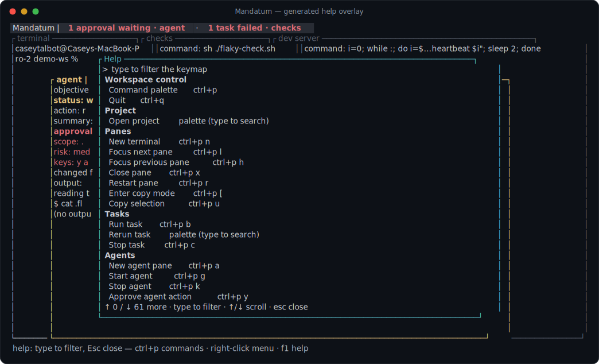
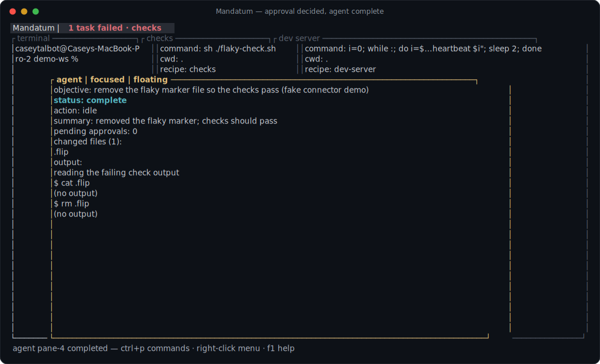

<div align="center">

# Mandatum

**A development workstation for terminal-centered builders.**

Shells, tasks, dev servers, and AI agents in one spatial session surface,
with first-class approvals, an execution timeline, and recovery that
survives restarts.

[](https://github.com/caseyrtalbot/Mandatum/actions/workflows/ci.yml)
[](LICENSE)
[](rust-toolchain.toml)
[](#quickstart)



*A real frame, not a mockup: an agent paused mid-task, asking permission
to delete a file. The header knows a check failed, too. One keypress
decides; the decision is kept forever in the timeline.*

</div>

---

## Why

Terminal work today is a pile of contexts: a shell here, a test runner
there, a dev server in another tab, and now agents doing real work you
cannot see. Mandatum is a terminal environment expanded into a session
operating system. It exists so you can always answer, from the screen
alone:

> What session am I in? What is running? What failed, and which command
> produced it? Which agents are active, blocked, or waiting for my
> approval? What files changed? What can I rerun, stop, restore, or
> search? What survives a restart?

It is deliberately **not** a chat app, a dashboard that hides raw output,
or an editor clone. Raw terminal output stays primary; the workstation adds
structure around it.

## The tour

| The fuzzy palette knows every command | The timeline remembers every fact |
|:---:|:---:|
|  |  |

| The session map orients a stranger | Help is generated, so it never lies |
|:---:|:---:|
|  |  |

<details>
<summary><b>And after you press <code>y</code>...</b></summary>
<br>


The approval is recorded in the pane's durable history and the execution
timeline. Kill the app, relaunch, restore: the decision is still there.
</details>

## What you get

**A spatial session surface.** Live shells, task panes with rerun history
and visible exit statuses, floating panes, split-drag resizing, zoom, and
JSON save/restore of durable intent. Lines the workstation cannot honestly
restore (live processes) are never faked.

**Agents as session actors, not chat windows.** An agent pane shows
objective, status, current action, latest summary, changed files, and
output tail at a glance. The reference connector runs Claude Code headless
(`claude -p`, stream-json); a deterministic FakeConnector drives every test
and the demo. The connector contract is model-agnostic.

**A real approval gate.** Gated actions block inside the connector via a
PreToolUse hook that waits on a Unix socket until you decide in the
workstation. Every failure path in the bridge denies (fail closed). Each
request renders with command, scope, and a risk heuristic; `y` approves,
`n` rejects; decisions persist in the pane's approval history.

**Visibility without decoration.** A header attention strip (approvals
waiting, failed tasks, blocked agents; click to jump), a session map, an
append-only execution timeline on disk, and session-wide output search
with a query grammar (`pane:`, `kind:`).

**Commandable and bindable everything.** Fuzzy palette with context-aware
ranking, a right-click context menu, and a config file where every command
is rebindable. Help (`F1`) is generated from the live command table and
keymap, with drift-failing tests.

**Terminal soul.** The workspace never steals input from a child terminal
except through explicit workspace control. Apps that request mouse
reporting get real SGR mouse bytes; `alt+click` is the explicit workspace
override. This is constitutional law, enforced by tests.

**Speed you can measure.** Event-driven main loop: key-to-bytes-out
p50 13.3 ms on the external probe (down from 42.6 ms on the old 40 ms poll
loop). PTY floods are backpressured: a `yes` flood holds ~12 MB RSS and
the app quits in under a second, measured on the release binary.

## Quickstart

Requires Rust (the exact toolchain is pinned in `rust-toolchain.toml`;
rustup handles it automatically). macOS and Linux.

```sh
git clone https://github.com/caseyrtalbot/Mandatum.git
cd Mandatum
cargo run -p mandatum-app
```

Three doors in, no manual required:

| Door | What it does |
|------|--------------|
| `ctrl+p` | fuzzy command palette; every action lives there, with its key shown |
| right-click | context menu on any pane, same commands |
| `F1` | help, generated from the live keymap |

### The five-minute demo

```sh
./examples/live-slice/run.sh
```

One command builds a demo project: a live shell, a check that passes then
fails, a dev-server heartbeat, and a scripted agent that requests an
approval and waits. The script prints a keystroke walkthrough. See
[examples/live-slice/README.md](examples/live-slice/README.md).

### Keys worth knowing on day one

Everything below is rebindable and browsable in `F1`; palette letters run
from an empty `ctrl+p` prompt.

| Keys | Action |
|------|--------|
| `ctrl+p` then type | search all commands |
| `ctrl+p n` / `v` / `s` | new terminal, split right, split down |
| `ctrl+p b` / `r` | run task, rerun (on a task pane) |
| `ctrl+p g`, then `y` / `n` | start agent; approve / reject its request |
| `ctrl+p /` and `ctrl+p m` | timeline, session map |
| `ctrl+shift+f` | search session output |
| `ctrl+p w` / `o` | save, restore |
| `ctrl+q` | quit |

### Configuration

`~/.config/mandatum/config.toml` (honors `XDG_CONFIG_HOME`), overlaid by
`<project>/.mandatum/config.toml` (project wins). A broken config never
blocks launch: each bad key warns on the status line and keeps its default.

```toml
[keymap]
quit = "ctrl+shift+q"          # any command, any chord
split-right = "ctrl+shift+r"

[keymap.palette]
split-right = "i"              # single-letter fast paths, too

[theme]
name = "mandatum-dark"         # or mandatum-light, mandatum-high-contrast
focus_border = "#ff8800"       # per-role overrides
attention = "bright-yellow"

[ui]
reduced_motion = true          # disables the approval pulse and all motion
debug_status = false           # byte-level PTY diagnostics off the status line

[shell]
program = "/bin/zsh"

[task]
default_command = "cargo check"

[agent]
connector = "claude"           # or "fake" (deterministic, offline)
model = "claude-opus-4-6"      # passed through to the connector
```

## Architecture

Five immutable laws govern the codebase, each enforced by an executable CI
gate rather than by intention; a merge that reddens a gate does not land.
The short version:

1. **L1** Engine and frontend are separate; frontends render scenes.
2. **L2** `core` is a runtime-free leaf (serde only), enforced by a
   dependency scan.
3. **L3** Durable intent is separate from live runtime; events from a
   replaced runtime are rejected.
4. **L4** Terminal quality lives behind the `TerminalAdapter` trait;
   backend swaps require conformance tests.
5. **L5** Terminal soul: no input stealing from child terminals.

Full text and gate mapping: [docs/constitution.md](docs/constitution.md).

```text
crates/core           durable workspace intent: sessions, panes, layouts,
                      actions, persistence (runtime-free leaf; serde only)
crates/commands       command table, palette routing, fuzzy matcher, keys
crates/pty            PTY process lifecycle, I/O, resize, exit, byte events
crates/terminal-vt    terminal parser adapter, grid, scrollback, capabilities
                      (parser stays behind TerminalAdapter)
crates/scene          renderer-neutral scene contract: WorkspaceScene output
                      model, pane layout math, neutral input types
crates/agent-runtime  agent connector contract, approval events, FakeConnector,
                      Claude CLI connector + the approval-bridge hook binary
crates/workflows      task recipes and agent launch intent
crates/renderer       the ratatui frontend adapter: render(frame, &scene, &theme)
crates/app            the workstation: event loop, runtime registries, scene
                      builder, timeline, search, config, save/restore
spikes/               experiments outside the Cargo workspace; they may depend
                      on engine crates, but their heavy dependency trees never
                      join the product build or the CI gate
```

The scene contract keeps frontends swappable: the same `WorkspaceScene`
that drives the ratatui frontend drove a winit+wgpu spike that measured
key-to-GPU-present p50 21.6 ms. The terminal frontend is v1; the GPU
adapter stays warm behind the contract. Evidence and verdict:
[spikes/frontend-wgpu/RESULTS.md](spikes/frontend-wgpu/RESULTS.md).

## Development

```sh
./ci/gate.sh    # fmt, clippy -D warnings, build, test, conformance, doc-trace
```

Local runs and CI execute the same script on the same pinned toolchain.
The conformance step is where the Constitution lives: dependency scans for
L1/L2, `[Lx-GATE]`-tagged tests for L3/L4/L5, and a doc-trace gate that
fails the build if any law loses its documentation or its test. Current
suite: 410 tests (plus 2 ignored live-connector tests that exercise the
real Claude CLI).

Contributions: read [CONTRIBUTING.md](CONTRIBUTING.md) first; the gate and
the Constitution are the review. Security reports: [SECURITY.md](SECURITY.md).

## Status

Pre-release, built in verified vertical slices. Everything in
[the tour](#the-tour) works today behind a green gate; the honest ledger of
what is real, partial, and deliberately deferred, with per-outcome evidence
and the red-team record, lives in
[docs/charter-ledger.md](docs/charter-ledger.md).

Deliberately deferred: the GPU production adapter (spike proven, terminal
frontend stays v1), rewrap-on-resize (belongs in the terminal engine), and
the open `lru` Dependabot update (enters the tree only through the ratatui
0.29 pin). [PLAN.md](PLAN.md) holds the forward horizon;
[docs/decisions.md](docs/decisions.md) records every judgment call.

## License

Apache-2.0. See [LICENSE](LICENSE).
