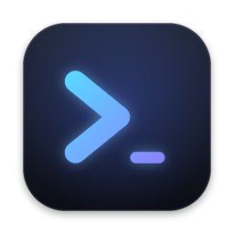
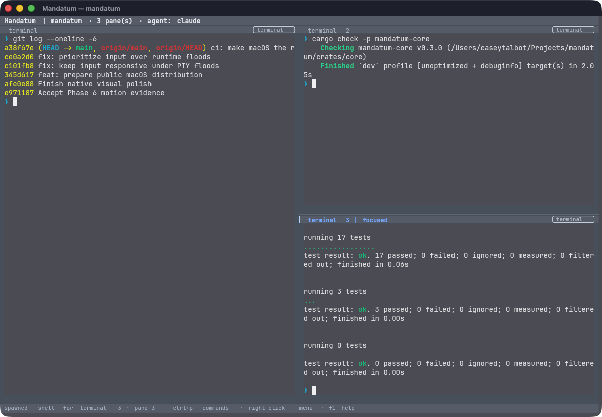
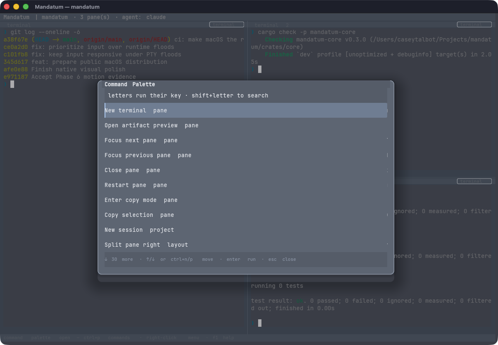
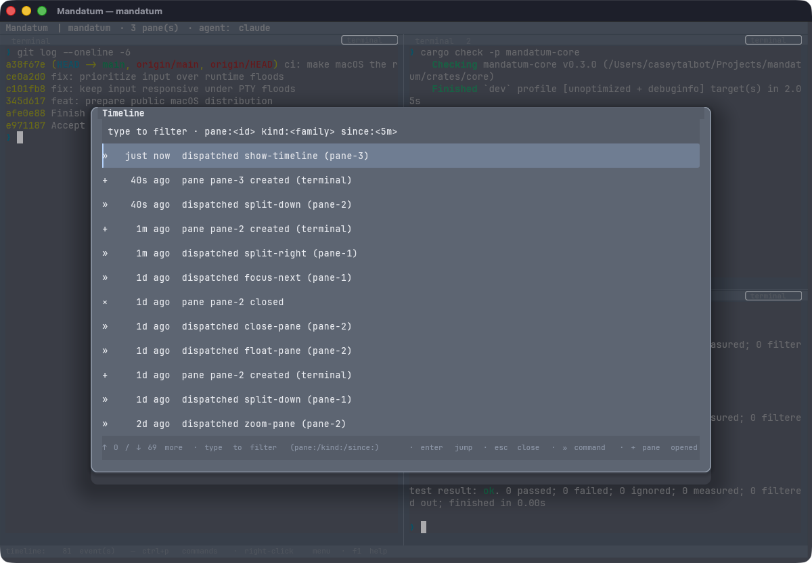

<!-- register: readme -->
<div align="center">



# Mandatum

Mandatum is a macOS app for terminal-centered work. Shells and build tasks
run as panes in one GPU-rendered workspace, with AI agents working beside
them. A timeline records what every pane did. When an agent wants to run a
shell command, it waits for your approval first.

[](https://github.com/caseyrtalbot/Mandatum/actions/workflows/ci.yml)
[](https://github.com/caseyrtalbot/Mandatum/releases/latest)
[](LICENSE)



</div>

## Install

```sh
curl --proto '=https' --tlsv1.2 -LsSf \
  https://raw.githubusercontent.com/caseyrtalbot/Mandatum/main/install.sh | sh
```

The script verifies the release's SHA-256 checksum before it touches
anything. It puts `Mandatum.app` in `/Applications` and a `mandatum`
command in `~/.local/bin`, and that is the whole footprint. The same
universal build runs on Apple Silicon and Intel Macs, macOS 11 or later.

If you would rather click, download `Mandatum.app.zip` from the
[latest release](https://github.com/caseyrtalbot/Mandatum/releases/latest).
Release builds carry a SHA-256 checksum and an ad-hoc signature rather than
Apple notarization, so a browser download warns on first launch; allow it
under System Settings > Privacy & Security. The install script verifies the
checksum itself and skips that dance.

## Use

```sh
cd ~/code/my-project
mandatum
```

```text
Opening Mandatum in /Users/you/code/my-project
```

The window opens on a shell in that project. Split it and run a task or a
dev server beside it as the work grows. Later:

```sh
mandatum update    # replace the app with the latest release
mandatum --version
```

Updates verify checksums before touching the installed app, and they refuse
downgrades.

## Around the workspace

Everything is reachable from the command palette, and the palette explains
any command that is currently unavailable.

| Keys | Action |
|---|---|
| `Ctrl-P` | Command palette |
| `Ctrl-P`, then `n` / `v` / `s` | New terminal / split right / split down |
| `Ctrl-P`, then `b` / `r` | Run task / rerun focused task |
| `Ctrl-P`, then `/` / `m` | Timeline / session map |
| `Ctrl-Shift-F` | Search all session output |
| `Ctrl-P`, then `w` / `o` | Save / restore workspace |
| `Ctrl-Q` | Quit |

| Command palette | Execution timeline |
|:---:|:---:|
|  |  |

The timeline records what ran and how it exited, along with agent state
changes and approval decisions, and you can filter it by pane or by time
window. Saved workspaces restore layout and pane intent after a restart,
down to focus and approval history. They do not resurrect processes that
were running, and Mandatum never pretends otherwise.

Terminal panes are real terminals. Input goes to the focused child process
unless you explicitly invoke a workspace command, so full-screen tools like
vim and htop behave normally. Text renders in a bundled JetBrains Mono
through a wgpu pipeline on Metal, with a generated Braille face filling
the gap no stock macOS monospace covers.

## Agents

Agent panes drive the [Claude Code CLI](https://code.claude.com), which you
install and authenticate separately; the rest of the app works without it.
When an agent wants to run a shell command, the pane pauses until you
approve or reject it, and the decision lands in the timeline. File reads
and writes go through automatically by default. This is a review gate
rather than a sandbox: you are the one approving, so read what you approve.

Mandatum is Latin for an order entrusted to someone else to carry out. The
approval prompt is where you decide whether to entrust it.

## Configuration

User settings live in `~/.config/mandatum/config.toml`, per-project
overrides in `<project>/.mandatum/config.toml`. Every key binding is
rebindable, and `F1` shows help generated from the live keymap, so it never
drifts from your bindings. Details are in
[the interaction model](docs/interaction-model.md).

Font and background color:

```toml
[font]
family = "Berkeley Mono"  # any installed family; omit for bundled JetBrains Mono
size = 15.0               # points

[theme.terminal]
background = "#0b0d12"    # terminal cells and the cleared frame

[theme.ui]
canvas = "#0b0d12"        # the native surface behind the panes
```

Colors apply the moment you run Reload Config. Font changes need an app
restart, and `--font-family` / `--font-size` override the file for a single
launch. A font the file asks for but the system cannot provide warns in the
status line and falls back to the default rather than blocking startup.

## Status

Mandatum is pre-release software. Current limits worth knowing before you
adopt it:

- one configured task command per project; named task and dev-server
  recipes are not implemented yet;
- artifact preview handles project-relative PNG files only;
- VoiceOver projection for the native surface is not implemented yet.

Building from source and the architecture docs, including the five
invariants CI enforces on every commit, are covered in
[CONTRIBUTING.md](CONTRIBUTING.md), [docs/constitution.md](docs/constitution.md),
and [docs/architecture.md](docs/architecture.md).

## License

Apache-2.0, with the bundled JetBrains Mono fonts keeping their SIL Open
Font License.
