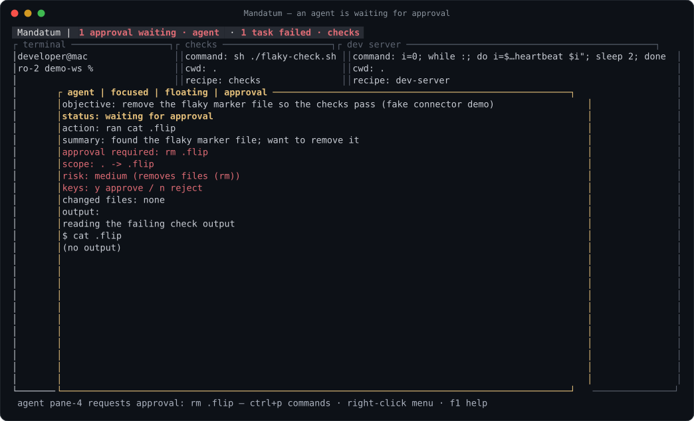
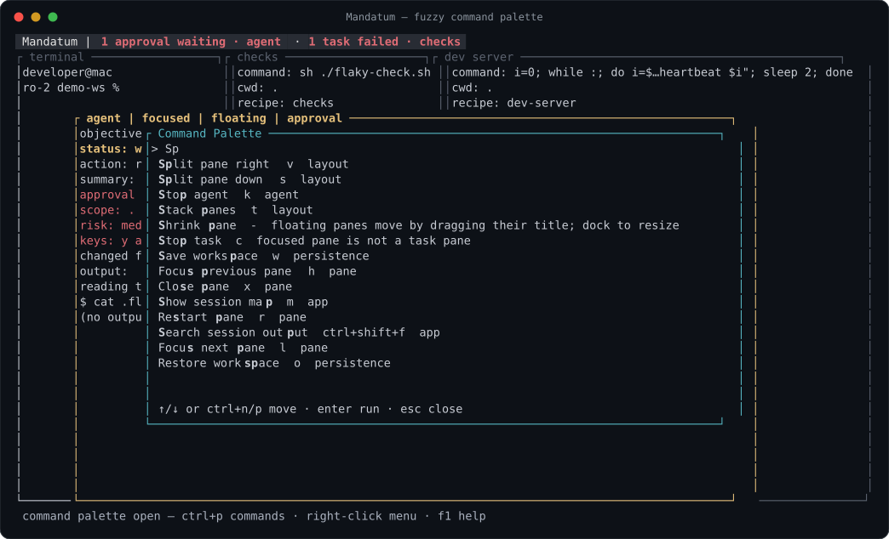
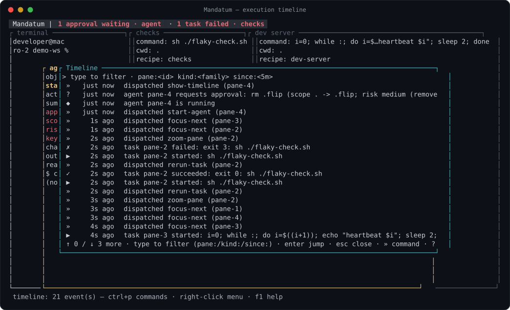
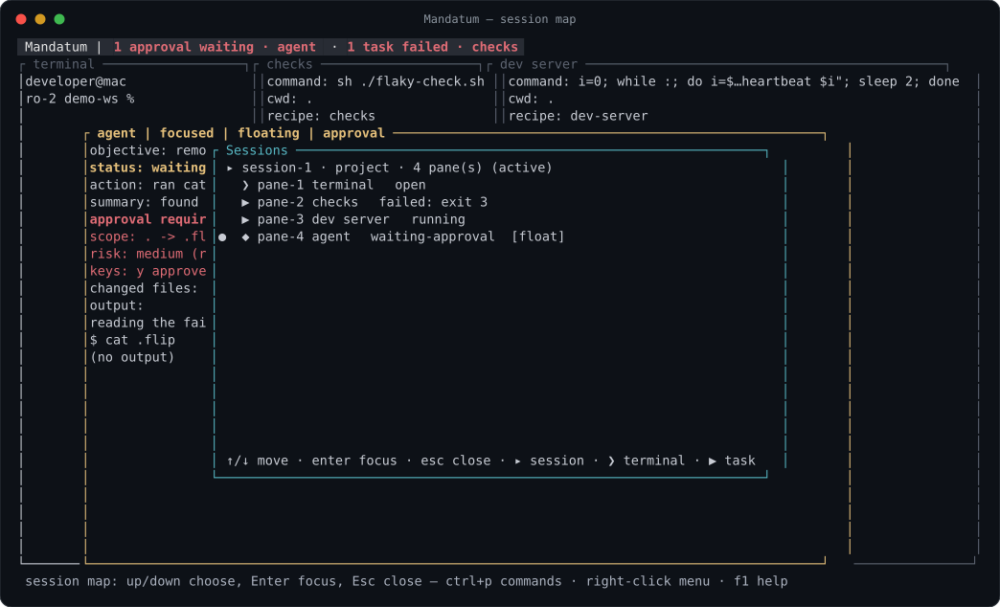
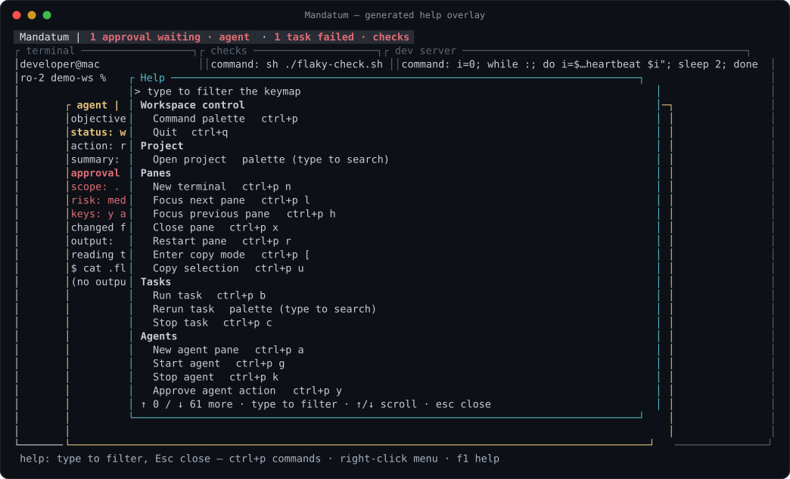

<div align="center">

# Mandatum

**A GPU-native development workstation with a terminal soul.**

Shells, tasks, long-running commands, and AI agents share one spatial session,
with visible failures, shell-command approvals, an execution timeline, and
durable workspace recovery.

[](https://github.com/caseyrtalbot/Mandatum/actions/workflows/ci.yml)
[](LICENSE)
[](rust-toolchain.toml)
[](#install)



*The maintained terminal frontend showing the same workspace model used by the
native application.*

</div>

## Why Mandatum

Modern development work is spread across shells, test runners, servers, and
agents. Mandatum keeps those actors visible in one session so you can quickly
answer:

- What is running, and what failed?
- Which command produced the failure?
- Which agent is active, blocked, or waiting for approval?
- What did the agent report changing?
- What can I rerun, stop, restore, or search?

Mandatum is not a chat wrapper or an editor replacement. It is a workstation
around the terminal: raw terminal applications remain first-class while native
structure makes concurrent work easier to supervise.

## Highlights

- **Spatial sessions:** tiled, stacked, floating, and zoomed panes for shells,
  tasks, agents, and PNG artifact previews.
- **Visible runtime state:** task exits, agent states, pending approvals, and
  attention items appear where they matter.
- **Agent approvals:** the default Claude connector pauses shell commands for
  an explicit approve or reject decision. The approval bridge fails closed
  when that gated protocol cannot complete.
- **Execution timeline:** commands, task outcomes, agent state changes, and
  approval decisions are recorded in a bounded, rotating timeline.
- **Search and navigation:** fuzzy command palette, session map, generated
  help, context menus, and session-wide output search.
- **Durable intent:** layouts, pane intent, focus, agent summaries, and approval
  history can survive restart. Live processes are never falsely presented as
  restored.
- **Terminal compatibility:** terminal input passes to the focused child unless
  an explicit workspace command intercepts it.
- **Native presentation:** the macOS application uses winit, wgpu, and a
  bundled JetBrains Mono family, with dark, light, and high-contrast themes.

| Command palette | Execution timeline |
|:---:|:---:|
|  |  |

| Session map | Generated help |
|:---:|:---:|
|  |  |

## Status

Mandatum is pre-release software. The native application currently targets
macOS on Apple Silicon and Intel. A terminal frontend remains available for
macOS and glibc-based Linux.

The repository is prepared to produce signed and Apple-notarized macOS binaries,
but the first compatible native release has not yet been published. Until a
signed release appears on [GitHub Releases](https://github.com/caseyrtalbot/Mandatum/releases),
build the native application from source.

Current limitations:

- restored workspaces restore durable intent, not previously running processes;
- one configured task command is available; named task and dev-server recipes
  are not yet implemented;
- artifact preview supports bounded project-relative PNG files, not general
  documents or URLs; and
- native macOS accessibility projection and VoiceOver support are not yet
  implemented.

## Install

### macOS release

Once a compatible release is published, install the build for the current Mac
from Terminal:

```sh
curl --proto '=https' --tlsv1.2 -LsSf \
  https://raw.githubusercontent.com/caseyrtalbot/Mandatum/main/install.sh | sh
```

The installer detects Apple Silicon or Intel, downloads the matching common and
native archives, verifies both SHA-256 checksums, validates every binary's
Developer ID signature against Mandatum's pinned Apple team, and installs three
commands in `~/.local/bin`:

```text
mandatum-native            GPU-native macOS application
mandatum                   terminal frontend and update command
mandatum-approval-bridge   agent approval helper
```

Add `~/.local/bin` to `PATH`, then launch the native application from a project
directory:

```sh
cd /path/to/project
mandatum-native
```

Release automation is configured to sign macOS binaries with a Developer ID
certificate, enable the hardened runtime, and submit the signed binaries to
Apple for notarization. Publishing fails if signing or notarization cannot
complete. The download is an architecture-specific command archive rather than
a `.app` bundle; the project does not claim a stapled or offline Gatekeeper
ticket.

To install somewhere else, set an absolute `MANDATUM_INSTALL_DIR`:

```sh
curl --proto '=https' --tlsv1.2 -LsSf \
  https://raw.githubusercontent.com/caseyrtalbot/Mandatum/main/install.sh \
  | MANDATUM_INSTALL_DIR="$HOME/bin" sh
```

### Build from source

Install [rustup](https://rustup.rs/), then:

```sh
git clone https://github.com/caseyrtalbot/Mandatum.git
cd Mandatum
cargo run --release -p mandatum-native --bin mandatum-native
```

The repository pins its Rust toolchain. Building the native application from
source requires macOS. The native workstation can start from that single build,
but gated agent sessions also require the separate approval bridge executable;
agent launch fails closed when it cannot resolve an executable bridge beside
Mandatum, on `PATH`, or through `MANDATUM_APPROVAL_BRIDGE`. To install both
public commands and the bridge from the checkout:

```sh
cargo install --locked --path crates/native --bin mandatum-native
cargo install --locked --path crates/app --bin mandatum
cargo install --locked --path crates/agent-runtime \
  --bin mandatum-approval-bridge
```

The terminal frontend also builds on glibc-based Linux:

```sh
cargo run --release -p mandatum-app --bin mandatum
```

## Updates

Installed releases update over the air through the terminal frontend:

```sh
mandatum update
mandatum --version
```

The updater downloads the latest published release, verifies its checksum, and
refuses to replace a newer build with an older one. On macOS it replaces
the `mandatum-native`, `mandatum`, and `mandatum-approval-bridge` set and
restores the previous set if replacement fails. It does not require a GitHub
account or a repository checkout.

Updates follow published version tags, not every commit to `main`. Review the
[release notes](https://github.com/caseyrtalbot/Mandatum/releases) before
updating when reproducibility matters.

An installation from before native archives were introduced needs one migration
step. Run `mandatum update` twice: the first run updates the terminal command
and its embedded installer while preserving the older archive contract; the
second run downloads the separate native archive. Rerunning the one-line
installer once has the same result.

## First run

Open the command palette with `Control-P`. It lists every command, its current
binding, and why an action is unavailable. Right-click opens the contextual
command menu, and `F1` opens help generated from the active keymap.

Useful defaults:

| Keys | Action |
|---|---|
| `Control-P` | Open the command palette |
| `Control-P`, then `n` / `v` / `s` | New terminal / split right / split down |
| `Control-P`, then `b` / `r` | Run task / rerun focused task |
| `Control-P`, then `/` / `m` | Open timeline / session map |
| `Control-Shift-F` | Search session output |
| `Control-P`, then `w` / `o` | Save / restore workspace |
| `Control-Q` | Quit |

Mandatum reads user configuration from
`~/.config/mandatum/config.toml` and project overrides from
`<project>/.mandatum/config.toml`. All commands are rebindable. See
[the interaction model](docs/interaction-model.md) for the full behavior.

Agent panes use the Claude Code connector by default. Agent features therefore
require a separately installed and authenticated `claude` CLI. The rest of the
workstation does not require an agent connector. By default Mandatum gates
shell commands; file reads and writes are auto-allowed. Approval scope is a
connector policy, not a sandbox or a promise that every mutation waits.

## Design and architecture

Five executable invariants keep product state independent from its frontends,
separate durable intent from live runtimes, isolate terminal parsing, and
protect terminal input routing. Read
[the Constitution](docs/constitution.md) for the short contract and
[the architecture](docs/architecture.md) for implementation boundaries.

Additional public documentation:

- [Product principles](docs/product-principles.md)
- [Developer workflows](docs/workflows.md)
- [Interaction model](docs/interaction-model.md)
- [Frontend strategy](docs/frontend-platform.md)
- [Repository structure](docs/repo-structure.md)
- [Contributing](CONTRIBUTING.md)
- [Security policy](SECURITY.md)

## License

Mandatum is licensed under the [Apache License 2.0](LICENSE). The bundled
JetBrains Mono fonts retain their SIL Open Font License; provenance and license
text live with the font assets.
